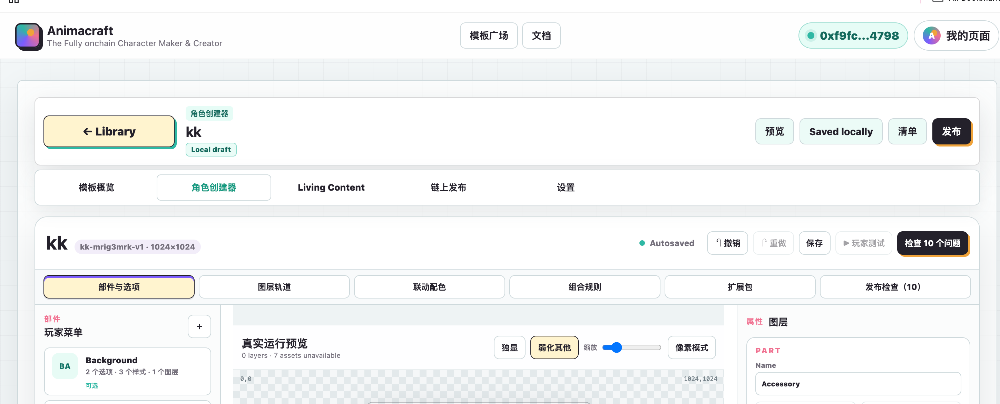

# Animacraft UI Layout Baseline

This document freezes the approved Creator Studio layout while the invited-creator release is being completed.

## Canonical Baseline

- Pull request: [#15 Fix Maker Studio canvas gaps](https://github.com/redefine-digital-labs/animacraft/pull/15)
- Merge commit: [`e3ba4f591b6fda0e3bef8b834ecc640b005bd822`](https://github.com/redefine-digital-labs/animacraft/commit/e3ba4f591b6fda0e3bef8b834ecc640b005bd822)
- Production surface: [animacraft.soulidity.ai](https://animacraft.soulidity.ai/)
- Baseline screenshot: [docs/ui-baseline-pr15.png](./docs/ui-baseline-pr15.png)

The screenshot and merge commit together are the reference. The commit identifies the exact source; the screenshot records the approved visual hierarchy.



## Frozen Product Surface

Do not add, remove, move, or reorder the current primary layout unless the product owner explicitly requests that exact change.

The frozen surface includes:

- global header, Template Plaza, Docs, wallet, and MyPage placement;
- Maker header, Library return, preview/save/manifest/release actions;
- Maker sections: Overview, Character Maker, Living Content, On-chain Publish, and Settings;
- Maker Studio toolbar, Parts & Items, Layer Tracks, Smart Color, Rules, Expansion Packs, and Preflight;
- the persistent three-column Character Maker workspace: Parts, runtime canvas and Items, Inspector;
- bounded tool dialogs opened from the Maker Studio toolbar.

## Allowed Work

The release may continue to improve the implementation inside the frozen surface:

- complete button behavior and remove fake or silent actions;
- improve validation, errors, loading, disabled, success, and recovery states;
- finish English, Simplified Chinese, Japanese, Korean, and Vietnamese copy;
- fix overflow, clipping, focus order, keyboard access, and screen-reader labels without restructuring the page;
- improve local draft persistence, rendering, Walrus upload, Sui signing, and publication correctness;
- add automated tests, browser checks, documentation, and performance fixes.

Small containment fixes must preserve the same visual hierarchy. A responsive fix may wrap or scroll existing controls, but may not invent a new navigation or move an editor area to a different product section.

## Changes Requiring Explicit Approval

- adding or deleting a primary section or Maker Studio tool;
- converting the three-column workspace to a different composition;
- moving actions between the global header, Maker header, toolbar, canvas, or Inspector;
- replacing the current light visual system, spacing scale, card treatment, or control hierarchy;
- reopening product scope already marked as frozen.

## Review Checklist

Every Creator Studio PR should answer:

1. Does the change preserve the PR #15 visual hierarchy?
2. Which existing function becomes more complete or reliable?
3. Are all visible strings translated in all five supported languages?
4. Is the behavior covered by an automated test and, when visual, a browser check?
5. Does `npm run check` pass?

Use this comparison before review:

```bash
git diff e3ba4f591b6fda0e3bef8b834ecc640b005bd822 -- index.html styles.css maker-workspace.js
```

## Recovery Procedure

Do not reset or rewrite `main`. If a later UI change is not acceptable, create a recovery branch from the baseline and selectively bring forward the valid functional work:

```bash
git switch -c codex/ui-recovery e3ba4f591b6fda0e3bef8b834ecc640b005bd822
git cherry-pick <approved-functional-commit>
```

Alternatively, restore only the affected UI file from the baseline on a new branch, review the diff, and submit a PR:

```bash
git restore --source=e3ba4f591b6fda0e3bef8b834ecc640b005bd822 -- index.html styles.css maker-workspace.js
```

Never roll back newer protocol, security, or data-model fixes solely to repair a visual regression.
